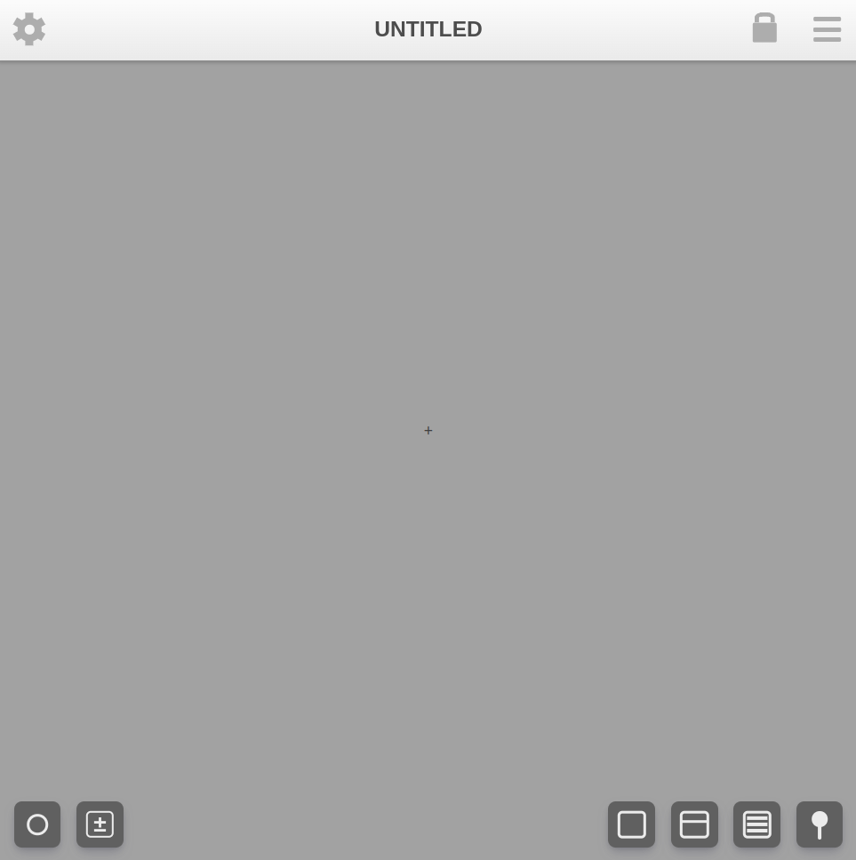
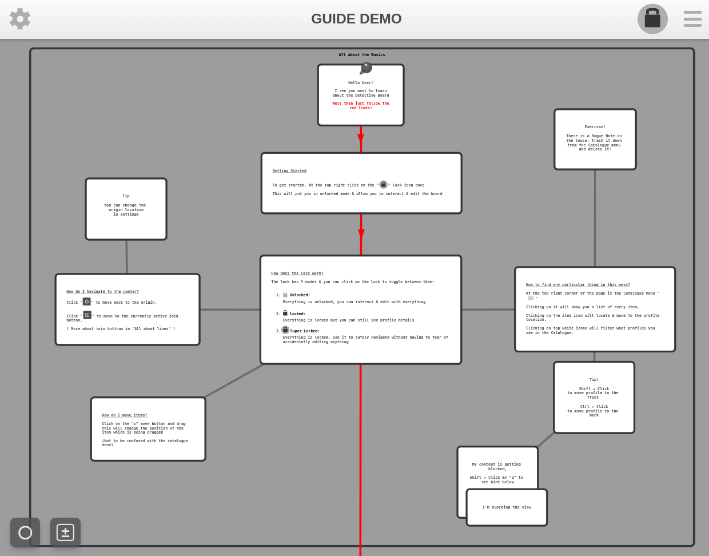
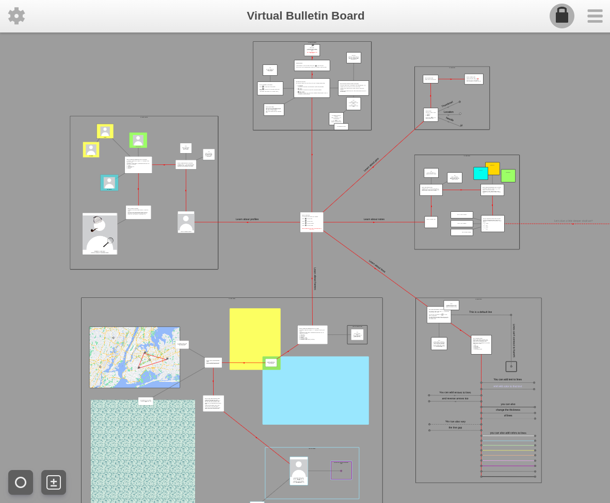

## Virtual Bulletin Board

Try it out: https://virtual-bulletin-board.netlify.app/

A simple yet versatile tool to help you visually represent and interconnect your data with maximum flexibility & customization.

Complete with:

1. Editable Profiles 
2. Notes
3. Pins
4. Frames
5. & Lines to interconnect them all

 

To get started, Open settings by clicking on the top left gear icon, Then press the "Help Demo" and it will give you a complete set of instructions on how to use every feature 

